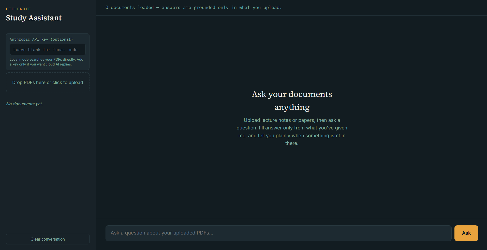

<div align="center">

# 🤖 AI Research Assistant

### AI-Powered Research Assistant for University Students

<p>
A portfolio prototype built during my <b>FlyRank AI Internship</b> to demonstrate
<strong>Prompt Engineering, AI Product Design, UI Development, and System Architecture.</strong>
</p>


</div>

---

# 📌 Overview

AI Research Assistant is a concept application designed to help university students interact with research papers, lecture notes, and study material using natural language.

This repository was created during my **FlyRank AI Internship** as part of a **Prompt Engineering Assignment**, where I progressively improved a simple prompt into a production-oriented AI application design.

> **Note**
>
> This repository demonstrates the **UI, project planning, prompt engineering process, and application architecture**.
>
> The backend and AI API integration are intentionally **not implemented** in this prototype.

---

<p align="center">
  
</p>


# 🚀 Features

✅ Modern Chat Interface

✅ Drag & Drop PDF Upload UI

✅ Student-Friendly Layout

✅ Responsive Design

✅ Portfolio Ready UI

✅ Prompt Engineering Documentation

✅ AI Product Planning

✅ System Architecture Planning

---

# 🎯 Purpose

This project was built to demonstrate:

- Prompt Engineering
- AI Product Thinking
- UI Development
- Software Architecture
- Technical Documentation
- AI Workflow Design

instead of delivering a production-ready AI application.

---

# 🧠 Prompt Engineering Journey

| Version | Layer Added | Result |
|----------|------------|--------|
| V0 | Weak Prompt | Generic AI Research Assistant |
| V1 | Clear Goal | PDF Upload + Q&A |
| V2 | Audience | Student-focused explanations |
| V3 | Context | Portfolio-oriented improvements |
| V4 | Output Format | Structured documentation |
| V5 | Quality Criteria | Production-ready architecture |

---

# 🏗 Project Architecture

```text
                User

                  │

                  ▼

        AI Research Assistant UI

                  │

      Upload PDF / Ask Questions

                  │

        (Future Backend API)

                  │

          Claude / OpenAI API

                  │

        Vector Database (RAG)

                  │

             AI Response
```

---

# 📂 Folder Structure

```text
AI-Research-Assistant/

│

├── index.html

├── style.css

├── script.js

├── assets/

│   ├── images/

│   └── icons/

├── README.md

└── LICENSE
```

---

# 💻 Tech Stack

| Frontend | AI | Design |
|----------|----|--------|
| HTML5 | Claude AI | Responsive UI |
| CSS3 | Prompt Engineering | Clean Layout |
| JavaScript | AI Product Planning | Modern Components |

---

# 📖 What I Learned

During this internship project, I learned:

- How prompt engineering improves AI output
- Importance of defining audience and context
- Structuring prompts incrementally
- Designing AI-first products
- Planning scalable AI systems
- Presenting technical work through documentation

---

# 🚧 Current Status

## ✅ Completed

- UI Design
- Prompt Engineering
- Project Planning
- Documentation
- Portfolio Presentation

---

## 🔄 Planned

- Backend Development
- AI API Integration
- PDF Processing
- RAG Pipeline
- Authentication
- Deployment

---

# 📌 Known Limitations

This repository is a **portfolio prototype**.

The following features are intentionally **not implemented**:

- Live Claude API
- OpenAI API
- Authentication
- Database
- Vector Search
- PDF Processing
- Conversation Memory

The purpose of this repository is to showcase the **design process**, **prompt engineering**, and **application planning** completed during the internship.

---

# 🌱 Future Roadmap

- FastAPI Backend
- React Frontend
- Authentication
- PDF Parsing
- Embeddings
- pgvector / Pinecone
- RAG
- Conversation History
- Deployment

---

# 🎓 About the Internship

This project was developed during my **FlyRank AI Internship**.

The assignment focused on learning how structured prompt engineering can transform a vague idea into a well-designed AI product by improving one prompt component at a time.

---

# 🤝 Connect With Me

**Vinay Kumar**

🎓 B.Tech — Artificial Intelligence & Machine Learning

Interested in:

- Artificial Intelligence
- Machine Learning
- AI Automation
- RAG Systems
- Intelligent Web Applications

⭐ If you like this project, consider giving it a star!
